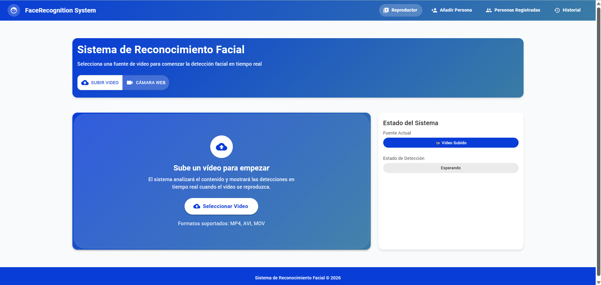
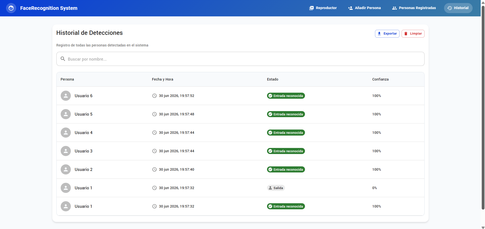

# Sistema de Reconocimiento Facial

Esta aplicación permite detectar rostros en tiempo real desde un video subido o desde la cámara web, compararlos con personas registradas y registrar automáticamente nuevos rostros cuando no coinciden con ninguna identidad conocida. El flujo completo combina visión por computador, embeddings faciales y una interfaz web moderna para visualizar detecciones y administrar personas.



## ¿Qué hace la aplicación?

La solución está pensada para tres escenarios principales:

- Detectar rostros en un video o en una transmisión en vivo desde la cámara web.
- Reconocer si un rostro corresponde a una persona ya registrada.
- Registrar automáticamente nuevos rostros como usuarios temporales y guardar una foto de perfil recortada.

Además, la app ofrece:

- Reproducción de videos cargados por el usuario.
- Activación y desactivación de la cámara web desde la interfaz.
- Visualización de recuadros alrededor de los rostros detectados.
- Historial de entradas y salidas.
- Gestión de personas registradas, incluyendo edición y eliminación.
- Captura de screenshots del frame actual.

## Arquitectura general

El proyecto está dividido en tres capas principales:

- Frontend: React + Vite + Material UI.
- Backend: FastAPI.
- Base de datos: PostgreSQL con pgvector para almacenar vectores faciales.

### Componentes principales

- Frontend: la interfaz permite cargar un video, activar la cámara web, iniciar detección y ver los recuadros sobre los rostros.
- Backend: expone endpoints para procesar frames, añadir personas, listar personas y consultar logs.
- Base de datos: guarda a cada persona su vector facial y metadatos como nombre, apellido, correo o rol.


## Flujo de detección

El proceso de reconocimiento sigue este camino:

1. La interfaz captura un frame desde el video o desde la cámara web.
2. Ese frame se convierte a una imagen base64 y se envía al endpoint de detección del backend.
3. El backend redimensiona la imagen para reducir el costo computacional.
4. Se detectan las coordenadas de los rostros mediante face_recognition.
5. Para cada rostro se extrae un vector de 128 dimensiones.
6. Ese vector se compara con los vectores almacenados de las personas registradas.
7. Si la distancia es suficientemente baja, se reconoce a la persona; si no, se registra automáticamente como un usuario nuevo.

## Concurrencia aplicada

Una de las partes más importantes del backend es la detección concurrente de múltiples rostros.

### Cómo se implementa

En el endpoint de detección, cada rostro detectado se procesa de forma independiente mediante ThreadPoolExecutor. El flujo es el siguiente:

- Se obtiene una lista de rostros detectados en el frame.
- Para cada rostro se crea una tarea en un pool de hilos.
- Cada tarea ejecuta la función de reconocimiento de forma aislada.
- Mientras una tarea procesa un rostro, las demás pueden hacerlo en paralelo.

Esto permite que si hay varias personas en la imagen, no se procesen de forma secuencial, sino de manera concurrente, mejorando el rendimiento en escenas con múltiples rostros.

En el código, la concurrencia se aplica con:

```python
with ThreadPoolExecutor(max_workers=min(8, max(1, len(face_locations)))) as executor:
    futures = [
        executor.submit(_recognize_face, face_location, rgb_frame, known_persons, threshold)
        for face_location in face_locations
    ]
```

Además, el frontend evita enviar solicitudes superpuestas mientras otra detección sigue en curso mediante un bloqueo interno, lo que reduce la carga del servidor y evita sobrecargar la aplicación durante la detección continua.

## Detección de caras

La detección facial se realiza con la librería face_recognition, usando la localización de rostros sobre la imagen RGB.

### Proceso

- Primero se convierte el frame a formato RGB.
- Luego se ejecuta face_recognition.face_locations(..., model="hog").
- El resultado son cajas delimitadoras de cada rostro detectado, con coordenadas top, right, bottom y left.

Estas coordenadas se usan para:

- recortar la zona del rostro para guardar una foto de perfil,
- extraer la codificación facial del rostro,
- dibujar un recuadro sobre la imagen en la interfaz (versiones posteriores).

## Extracción y comparación de vectores faciales

Cada rostro se convierte en un vector facial de 128 dimensiones. Ese vector representa las características geométricas del rostro en un espacio numérico.

### Extracción

Cuando un rostro es detectado, se extrae su codificación con:

```python
face_encodings = face_recognition.face_encodings(rgb_frame, [face_location])
```

El resultado es un vector que se convierte a lista y se almacena para su comparación posterior.

### Comparación

La comparación se realiza mediante la función de distancia facial de face_recognition. La idea es simple:

- Si el vector del rostro nuevo es muy cercano al vector de una persona conocida, se considera que es esa persona.
- Si la distancia es alta, se asume que no coincide con ninguna persona registrada.

La distancia se calcula con una función equivalente a:

```python
face_recognition.face_distance([a], b)
```

### Umbral de reconocimiento

El sistema usa un umbral configurable, por defecto 0.6:

- Distancia menor o igual al umbral: se reconoce a la persona.
- Distancia mayor: no se reconoce y se considera un nuevo rostro.

Cuanto menor sea la distancia, mayor será la similitud entre rostros.

## Registro automático de personas

Cuando aparece un rostro que no coincide con nadie conocido, la aplicación lo registra automáticamente como un usuario nuevo con el nombre:

- Usuario N

Por ejemplo: Usuario 1, Usuario 2, Usuario 3, etc.

En ese caso se guardan:

- el vector facial,
- el nombre generado,
- una foto de perfil recortada del rostro,
- metadatos como la fecha de registro.

Esto permite que la detección siga funcionando incluso cuando aparece alguien nuevo por primera vez.

## Gestión de personas

La app permite administrar personas registradas desde la interfaz:

- Añadir personas manualmente desde una imagen.
- Editar datos de una persona.
- Eliminar personas del sistema.
- Visualizar la foto de perfil asociada.


## Historial y eventos

La aplicación registra eventos de entrada y salida de personas detectadas. Se implementa una lógica de gracia de 30 segundos antes de marcar la salida, lo que evita falsos positivos por pequeños parpadeos de detección.

Esto es útil para escenarios donde una persona está presente unos segundos y la detección intermitente podría marcarla como salida innecesariamente.



## Requisitos principales

- Python 3.10+
- FastAPI
- Uvicorn
- OpenCV
- NumPy
- face_recognition
- SQLAlchemy
- PostgreSQL
- pgvector
- React
- Vite
- Material UI

## Ejecución con Docker

El proyecto incluye un archivo de Docker Compose para levantar el backend, el frontend y la base de datos.

### Pasos

```bash
docker compose up --build
```

Esto levantará:

- el backend en el puerto configurado,
- el frontend en el puerto 5173,
- la base de datos PostgreSQL con pgvector.

## Variables de entorno

El proyecto espera variables como:

- DB_USER
- DB_PASSWORD
- DB_NAME
- DB_HOST
- DB_PORT
- BACKEND_PORT
- FACE_RECOGNITION_THRESHOLD

## Resumen funcional

En resumen, la aplicación hace lo siguiente:

- captura frames desde video o webcam,
- detecta rostros en cada frame,
- extrae vectores faciales,
- compara los vectores con los ya almacenados,
- reconoce personas registradas,
- registra automáticamente nuevos rostros,
- muestra recuadros en tiempo real y mantiene un historial de detecciones.

Esta combinación permite tener un sistema de reconocimiento facial bastante completo, con soporte para múltiples rostros, registro automático, gestión de personas y una interfaz simple pero funcional.
